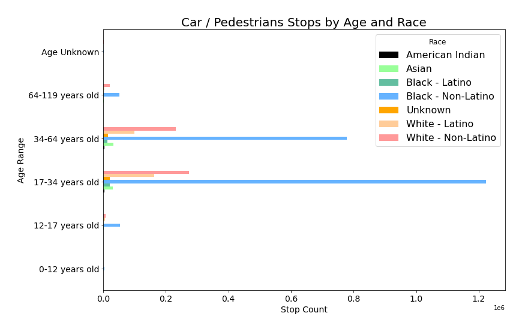
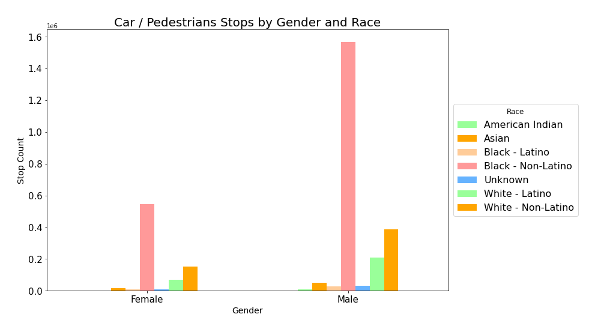
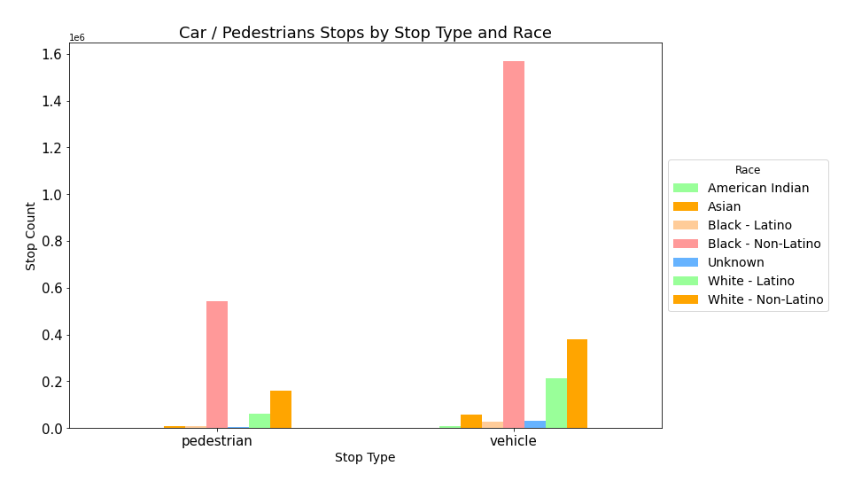

# Vehicle & Pedestrians Investigations

This Notebook generates plots of data queried from [Vehicle & Pedestrian Investigations Dataset](https://opendataphilly.org/datasets/vehicle-pedestrian-investigations/) and saves the image in the directory. The following categories are available:

- Stops by Age and Race (saved as stops_by_age_and_race.png)

- Stops by Gender and Race (saved as stops_by_gender_and_race.png)

- Stops by Stop Type and Race (saved as stops_by_stoptype_and_race.png)

## Recognition

This project was referenced in the peer-reviewed publication:

"[For Us By Us: Intentionally Designing Technology for Lived Black Experiences](https://dl.acm.org/doi/10.1145/3643834.3661535)"  
by Lisa Egede, Leslie Coney, Brittany Johnson, Christina N. Harrington, and Denae Ford.  
Published in the *Proceedings of the 2024 Designing Interactive Systems Conference*.
